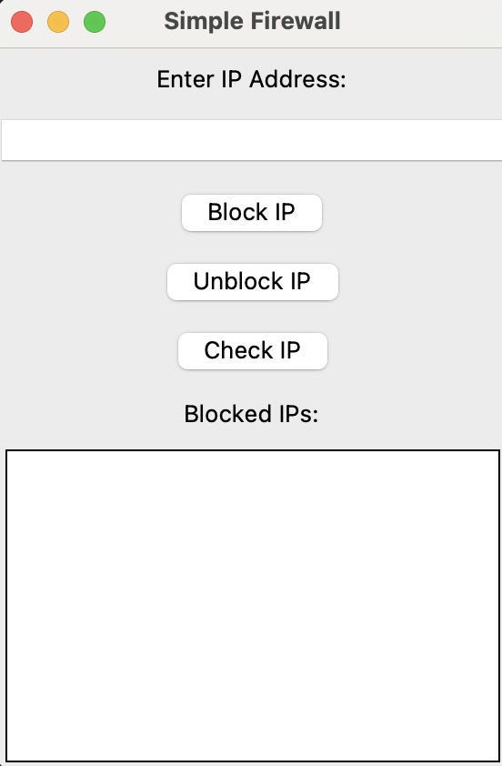

[](https://opensource.org/licenses/MIT)
[](https://www.python.org/downloads/)
[](https://github.com/Pmvita/Firewall-IP-Blocker/actions)
[](https://www.comptia.org/certification/network-plus)


<div align="center">
    
</div>

<h1 align="center">🔥 Simple Firewall with IP Blocking</h1>


A Python-based **Firewall Application** with a **Graphical User Interface (GUI)** that blocks unauthorized IP addresses and logs malicious activity.

## 🚀 Features

✅ **Block & Unblock IPs**: Add or remove IP addresses from the blocked list.  
✅ **Check Access**: Verify if an IP address is blocked.  
✅ **Activity Logging**: Keeps a log of all blocked/unblocked IPs in `firewall_log.txt`.  
✅ **User-Friendly GUI**: Simple interface built using **Tkinter**.  

## 🛠️ Installation

1. **Clone the repository**:
   ```sh
   git clone https://github.com/Pmvita/Firewall-IP-Blocker.git
   cd Firewall-IP-Blocker
   ```

2. **Ensure Python is installed** (Python 3.7+ required).  
   Check your version:
   ```sh
   python --version
   ```

3. **Install required dependencies**:
   ```sh
   pip install -r requirements.txt
   ```
   *(If `requirements.txt` is missing, manually install dependencies: `pip install tk`.)*

## 📌 Usage

**Run the Firewall Application**:
```sh
python firewall.py
```

**Available Actions**:
- **Block IP**: Enter an IP address and click "Block IP" to add it to the blocked list.
- **Unblock IP**: Select a blocked IP and click "Unblock IP" to remove it.
- **Check IP**: Enter an IP and click "Check IP" to see if it's blocked.

## 📂 File Structure

```
Firewall-IP-Blocker/
├── firewall.py         # Main Firewall Application
├── firewall_log.txt    # Logs blocked/unblocked IPs
├── requirements.txt    # Dependencies
├── README.md           # Documentation
```

## 🖥️ Screenshots

### 🔹 Main Interface
<div align="center">
    
</div>

*(Save screenshots in a `screenshots/` folder inside the project directory.)*

## 🤝 Contributing

Contributions are welcome! Feel free to fork the repository, improve the code, and submit a pull request.

## 📜 License

This project is licensed under the **MIT License**.

## ✨ Author

Developed by **Pierre Mvita**  
GitHub: [Pmvita](https://github.com/Pmvita)
